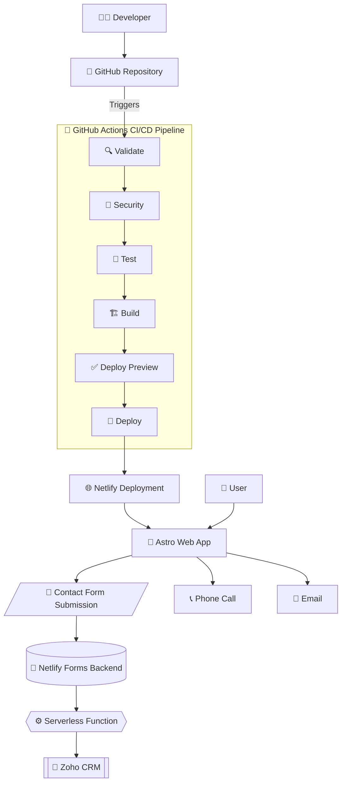

# Architecture

```mermaid
graph TD
    Dev[👨‍💻 Developer] --> GitHub[📁 GitHub Repository]
    GitHub -->|Triggers| Validate[🔍 Validate]

    subgraph "🤖 GitHub Actions CI/CD Pipeline"
        Validate --> Security[🔐 Security]
        Security --> Test[🧪 Test]
        Test --> Build[🏗️ Build]
        Build --> Preview[✅ Deploy Preview]
        Preview --> Deploy[🚀 Deploy]
    end

    Deploy --> Netlify[🌐 Netlify Deployment]
    Netlify --> WebApp[🚀 Astro Web App]
    User[👤 User] --> WebApp
    WebApp --> Form[/📝 Contact Form Submission/]
    WebApp --> Phone[📞 Phone Call]
    WebApp --> Email[📧 Email]
    Form --> NetlifyForms[(💾 Netlify Forms Backend)]
    NetlifyForms --> Function{{⚙️ Serverless Function}}
    Function --> ZohoCRM[[💼 Zoho CRM]]
```
